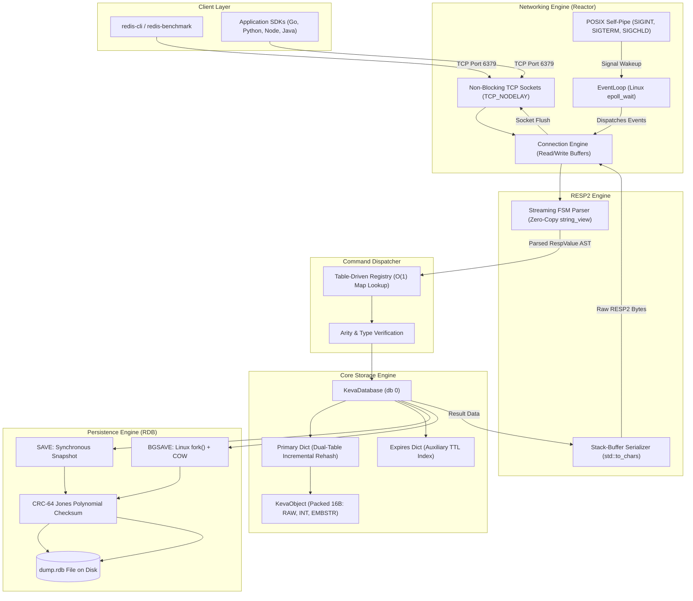
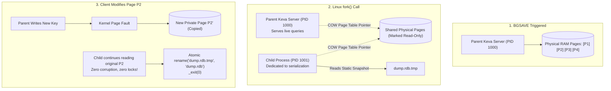

<div align="center">

# ⚡ KEVA DB

### High-Performance, Zero-Dependency In-Memory Key-Value Store Engineered in C++20

*A Redis-compatible in-memory database built from scratch to achieve predictable sub-millisecond latency, zero stop-the-world pauses, and mechanical sympathy with the Linux kernel.*

---

[](https://en.cppreference.com/w/cpp/20)
[](https://kernel.org/)
[-DC382D?style=for-the-badge&logo=redis&logoColor=white)](https://redis.io/docs/reference/protocol-spec/)
[-brightgreen?style=for-the-badge&logo=cmake&logoColor=white)](https://cmake.org/)
[](https://clang.llvm.org/docs/AddressSanitizer.html)
[](https://www.docker.com/)
[](https://opensource.org/licenses/MIT)

[**Explore Documentation**](documentation.md) •
[**Quick Start**](#-quick-start) •
[**Architecture**](#-system-architecture--workflow) •
[**Benchmarks**](#-performance--benchmarks) •
[**Command Reference**](#-api--command-reference) •
[**Contributing**](#-contributing-guide)

</div>

---

## 📖 Table of Contents

- [The Problem & Why Keva Matters](#-the-problem--why-keva-matters)
- [Key Architectural Innovations](#-key-architectural-innovations)
- [Comprehensive Features](#-features)
- [System Architecture & Workflow](#-system-architecture--workflow)
  - [High-Level Architecture Diagram](#high-level-architecture-diagram)
  - [Request-Response Execution Lifecycle](#request-response-execution-lifecycle)
  - [Fork & Copy-on-Write (COW) Snapshot Pipeline](#fork--copy-on-write-cow-snapshot-pipeline)
- [Technology Stack & Rationale](#-technology-stack--rationale)
- [Quick Start & Installation](#-quick-start)
  - [Prerequisites](#prerequisites)
  - [Building from Source (WSL2 / Linux)](#building-from-source-wsl2--linux)
  - [Running the Server](#running-the-server)
  - [Running with Docker](#running-with-docker)
  - [Running Test Suites](#running-test-suites)
- [Configuration & Environment](#-configuration--environment)
- [Usage Guide & Client Connectivity](#-usage-guide--client-connectivity)
  - [Using `redis-cli`](#1-using-redis-cli)
  - [Python (`redis-py`)](#2-python-redis-py)
  - [Go (`go-redis`)](#3-go-go-redis)
  - [Node.js (`ioredis`)](#4-nodejs-ioredis)
  - [Raw TCP / Netcat](#5-raw-tcp--netcat)
- [API & Command Reference](#-api--command-reference)
  - [String Commands](#string-commands)
  - [Key Space & Expiry Commands](#key-space--expiry-commands)
  - [Server Administration Commands](#server-administration-commands)
- [Repository Folder Structure](#-repository-folder-structure)
- [Interactive Terminal Showcase](#-interactive-terminal-showcase)
- [Performance & Benchmarks](#-performance--benchmarks)
- [Engineering Roadmap](#-engineering-roadmap)
- [Contributing Guide](#-contributing-guide)
- [License](#-license)
- [Author & Acknowledgments](#-author--acknowledgments)

---

## 💡 The Problem & Why Keva Matters

In modern web scale infrastructure, distributed caching and in-memory key-value engines sit directly on the critical path of every request. Traditional solutions often introduce subtle but severe operational pain points:

| Pain Point in Typical Caches | How Keva Solves It |
|---|---|
| **Stop-the-World Rehashing Spikes**<br>Standard hash tables (`std::unordered_map`, Java `HashMap`) reallocate all buckets at once when reaching load thresholds, locking execution for 50ms–300ms. | **Progressive Incremental Rehashing**<br>Maintains dual tables (`ht[0]`, `ht[1]`). Buckets are migrated step-by-step per operation and during 10Hz cron ticks with **zero latency spikes**. |
| **Thread-per-Connection Bloat**<br>Allocating an OS thread per client connection consumes 2MB–8MB stack per thread, causing catastrophic kernel scheduler thrashing at 10,000+ connections. | **Single-Threaded epoll Reactor**<br>A single Linux thread multiplexes thousands of non-blocking TCP connections via `epoll_wait` with negligible idle CPU and memory consumption. |
| **TTL Memory Penalty on Persistent Keys**<br>Conventional databases attach an 8-byte TTL timestamp to every key-value object, wasting megabytes of RAM on persistent keys. | **Dual-Dictionary Architecture**<br>Keys with active TTLs are tracked in an auxiliary `expires_` table. Persistent keys incur **zero bytes** of TTL memory overhead. |
| **Adversarial HashDoS Attacks**<br>Predictable hash algorithms (FNV, MurmurHash) allow attackers to craft colliding keys that degrade $O(1)$ lookups into $O(N)$ CPU exhaustion. | **SipHash-1-2 Cryptographic PRF**<br>Seeded at boot with a 128-bit key from `/dev/urandom`, rendering algorithmic collision attacks computationally impossible. |
| **Black-Box Complexity & Dependencies**<br>Modern enterprise caches bundle millions of lines of legacy C/C++, complex scripting engines, and opaque background threads. | **Zero-Dependency Native C++20 Core**<br>100% written from scratch. Clear mechanical sympathy with Linux primitives: non-blocking sockets, `fork()` COW, and atomic file renaming. |

---

## 🚀 Key Architectural Innovations

- 🎯 **100% Wire-Compatible RESP2**: Works out of the box with standard Redis tooling (`redis-cli`, `redis-benchmark`) and any language SDK (Python, Go, Node.js, Rust, Java).
- 🧠 **Packed 16-Byte KevaObject Header**: Packs logical type (4b), physical encoding (4b), and 24-bit LRU clock into a single 32-bit word, paired with a 32-bit refcount and 64-bit payload pointer.
- 🏎️ **Three-Tiered Memory Encodings**:
  - `INT`: Signed 64-bit integers stored directly in the pointer field (**zero heap allocations**).
  - `EMBSTR`: Strings $\le 44$ bytes allocated contiguously with the header in a single 64-byte block (1 L1 cache-line hit).
  - `RAW`: Heap-allocated dynamic binary-safe byte buffer for arbitrary payloads.
- ⚡ **Zero-Allocation Stack Response Serialization**: `RespEncoder` leverages `std::to_chars` with stack buffers to stream numbers and bulk string headers directly into socket write queues without heap allocations.
- 🛡️ **Binary-Safe `Buffer`**: Unlike `std::string`, Keva's dynamic buffer tracks explicit length and accepts embedded null (`\0`) bytes, binary protobufs, and compressed payloads.
- 💾 **Point-in-Time Persistence (`BGSAVE`)**: Employs Linux `fork()` to leverage kernel virtual memory Copy-on-Write (COW). The parent serves queries with zero locks while the child saves a snapshot to `dump.rdb` protected by a 64-bit CRC checksum.
- 🧹 **Dual Expiration Mechanics**: Combines passive lazy eviction on query with active 10Hz probabilistic sampling (sampling 20 keys with a 25% dirty threshold).

---

## 🌟 Features

### 📦 Core Engine & Data Types
- **Binary-Safe Strings**: Store text, UTF-8 emojis, raw binaries, images, or serialized JSON/Protobufs.
- **Atomic 64-Bit Integer Arithmetic**: Full support for `INCR`, `DECR`, `INCRBY`, `DECRBY` with strict `LLONG_MAX` / `LLONG_MIN` overflow detection.
- **TTL & Expiry Engine**: Precision second and millisecond expirations (`SETEX`, `PSETEX`, `EXPIRE`, `PEXPIRE`, `EXPIREAT`, `TTL`, `PTTL`, `PERSIST`).
- **Atomic Multi-Key Transactions**: `MSET`, `MGET`, `EXISTS`, and `DEL` across arbitrary key counts.
- **Glob Pattern Matching**: Full keyspace pattern search with `KEYS pattern` supporting `*` and `?` wildcards.

### 🌐 Systems & Networking
- **Linux `epoll` Reactor**: High-efficiency event-driven I/O multiplexing running on a single non-blocking thread.
- **TCP Optimization**: Explicitly disables Nagle's algorithm (`TCP_NODELAY`) to eliminate 40ms delayed-ACK latency on tiny frames.
- **POSIX Self-Pipe Trick**: Safe asynchronous signal dispatching (`SIGINT`, `SIGTERM`, `SIGCHLD`) directly into the reactor loop without reentrancy bugs.
- **Connection Cursor Compaction**: Streaming read buffers that avoid $O(N)$ memory copies during partial packet reads.

### 💾 Reliability & Durability
- **Non-Blocking RDB Snapshots (`BGSAVE`)**: Linux `fork()` + Copy-on-Write memory isolation.
- **Synchronous Snapshots (`SAVE`)**: Predictable synchronous durability for cold maintenance and graceful shutdowns.
- **Atomic Inode Swapping**: Writes to `dump.rdb.tmp` followed by POSIX atomic `rename()` to prevent partial snapshot corruption on power loss.
- **Jones Polynomial CRC-64**: Validates snapshot data integrity upon cold-start loading to detect disk corruption or bit rot.
- **Zombie Process Supervisor**: Automatic child reaping via `SIGCHLD` and `waitpid(WNOHANG)`.

---

## 🏗️ System Architecture & Workflow

### High-Level Architecture Diagram



---

### Request-Response Execution Lifecycle

Tracing the end-to-end flow of `SET user:1 "Alice" EX 60`:

```mermaid
sequenceDiagram
    autonumber
    actor Client as Redis Client / App
    participant Kernel as Linux Kernel (epoll)
    participant Loop as EventLoop & Connection
    participant Parser as RESP2 Parser (FSM)
    participant Dispatcher as Command Router
    participant Engine as Storage Engine (Dict & Object)
    participant Encoder as RESP2 Encoder

    Client->>Kernel: Send "*5\r\n$3\r\nSET\r\n$6\r\nuser:1\r\n$5\r\nAlice\r\n$2\r\nEX\r\n$2\r\n60\r\n"
    Kernel-->>Loop: epoll_wait() returns EPOLLIN
    Loop->>Loop: fill_read_buffer() appends bytes to read_buf_
    Loop->>Parser: parse(read_view)
    Parser-->>Loop: Returns RespValue Array & consumed byte count
    Loop->>Loop: consume(offset) advances cursor
    Loop->>Dispatcher: dispatch(CommandContext)
    Dispatcher->>Dispatcher: Validate command name "SET" and arity (5 in range [3, -1])
    Dispatcher->>Engine: handle_set(key="user:1", val="Alice", EX=60)
    Engine->>Engine: KevaObject::create_string("Alice") -> Allocates EMBSTR (<=44B)
    Engine->>Engine: Dict::set("user:1", obj) -> Inserts & triggers rehash_step(1)
    Engine->>Engine: Dict::set_expire("user:1", now_ms + 60,000)
    Engine->>Encoder: RespEncoder::ok(conn)
    Encoder->>Loop: Writes "+OK\r\n" directly to write_buf_
    Loop->>Kernel: flush_write_buffer() -> write(fd)
    Kernel-->>Client: Receive "+OK\r\n"
```

---

### Fork & Copy-on-Write (COW) Snapshot Pipeline

When `BGSAVE` is executed, Keva leverages Linux's virtual memory subsystem to generate an instantaneous point-in-time snapshot with **zero physical data duplication**:



---

## 🛠️ Technology Stack & Rationale

| Layer / Technology | Component Used | Architectural Rationale |
|---|---|---|
| **Core Systems Language** | **ISO C++20** | Enforces zero-cost abstractions, `std::span`, `std::string_view`, explicit memory lifetimes, RAII resource destruction, and strict compiler flags (`-Wall -Wextra -Wpedantic`). |
| **I/O Multiplexing** | **Linux `epoll`** | $O(1)$ event scalability across tens of thousands of idle connections. Level-triggered notifications ensure zero lost bytes on partial reads. |
| **Low-Latency Networking** | **POSIX Non-Blocking Sockets** | Sockets configured with `O_NONBLOCK` and `TCP_NODELAY` to eliminate Nagle's 40ms buffering delays for small database replies. |
| **Process Virtualization** | **Linux `fork()` & COW** | Enables background RDB snapshots (`BGSAVE`) without database locks or heap cloning, delegating page duplication to the Linux kernel. |
| **Signal Safety** | **POSIX Self-Pipe Trick (`pipe2`)** | Translates asynchronous POSIX signals (`SIGINT`, `SIGCHLD`) into synchronous `EPOLLIN` loop events to eliminate reentrancy bugs. |
| **Hash Algorithm** | **SipHash-1-2** | Fast, cryptographically secure pseudorandom function keyed by a 128-bit seed from `/dev/urandom` to neutralize algorithmic HashDoS attacks. |
| **Data Integrity** | **CRC-64 (Jones Polynomial)** | Verifies cold-start snapshot integrity with an $O(1)$-per-byte lookup table (`0xad93d23594c935a9ULL`). |
| **Build & Toolchain** | **CMake 3.20+ & Ninja** | Fast, deterministic parallel compilation supporting AddressSanitizer (ASan) in Debug and Link-Time Optimization (LTO) in Release. |
| **Deployment** | **Multi-Stage Docker** | Stage 1 builds optimized release binaries; Stage 2 provides a minimal, secure Ubuntu container with a non-root service user. |
| **Quality & Correctness** | **ASan, UBSan, CTest, Python** | Continuous sanitization across heap, stack, and pointer boundaries alongside automated end-to-end TCP integration suites. |

---

## ⚡ Quick Start

### Prerequisites

- **Linux / WSL2**: Ubuntu 22.04 LTS or 24.04 LTS recommended.
- **Compiler**: GCC 12+ or Clang 15+ with C++20 support.
- **Build Tools**: CMake 3.20+ and Ninja.
- **Client Tools**: `redis-tools` (provides `redis-cli` and `redis-benchmark`) and `python3`.

```bash
# Ubuntu / Debian / WSL2
sudo apt-get update
sudo apt-get install -y build-essential gcc-12 g++-12 cmake ninja-build redis-tools python3 python3-pip git
```

---

### Building from Source (WSL2 / Linux)

Clone the repository and select your build profile:

```bash
git clone https://github.com/tusharkkp/Keva-DB.git
cd Keva-DB
```

#### Option A: Debug Build (Recommended for Development)
Enables `-O0 -g3`, `AddressSanitizer` (ASan) for memory safety verification, and `UndefinedBehaviorSanitizer` (UBSan):

```bash
cmake -B build -DCMAKE_BUILD_TYPE=Debug -G Ninja
cmake --build build --parallel
```

#### Option B: Release Build (Production Benchmarks)
Enables maximum compiler optimization (`-O3`) and Link-Time Optimization (LTO):

```bash
cmake -B build -DCMAKE_BUILD_TYPE=Release -G Ninja
cmake --build build --parallel
```

---

### Running the Server

Start Keva with default settings (listening on `0.0.0.0:6379`):

```bash
./build/src/keva-server
```

Or customize port, log level, memory threshold, and persistence:

```bash
./build/src/keva-server --host 127.0.0.1 --port 6379 --loglevel info --maxmemory 1073741824 --rdb-filename dump.rdb
```

---

### Running with Docker

Keva includes an automated multi-stage `Dockerfile`:

```bash
# Build the production Docker image
docker build -t keva:latest .

# Run in container with port forwarding and persistent volume
docker run -d --name keva-db -p 6379:6379 -v keva_data:/var/lib/keva keva:latest

# Verify container status and logs
docker ps
docker logs keva-db

# Test connectivity from your host
redis-cli -p 6379 PING
```

---

### Running Test Suites

#### 1. Unit Tests (CTest)
Validates hash table rehashing, buffer expansion, bitfields, and streaming parser edge cases under ASan/UBSan:

```bash
cd build && ctest --output-on-failure
```

#### 2. End-to-End Integration Suite (Python)
Executes comprehensive black-box tests verifying live RESP2 socket compliance:

```bash
python3 tests/integration/test_redis_cli.py
```

---

## ⚙️ Configuration & Environment

Keva can be configured using command-line arguments or an environment variable file (`.env`).

### Command-Line Arguments Reference

| Flag | Argument | Default | Description |
|---|---|---|---|
| `--host`, `-h` | `<ip_address>` | `0.0.0.0` | Network IP interface to bind listener |
| `--port`, `-p` | `<port_number>` | `6379` | TCP port for incoming client connections |
| `--loglevel` | `debug\|info\|warn\|error` | `info` | Minimum log level for console output |
| `--maxmemory` | `<bytes>` | `0` (unlimited) | Memory ceiling before approximated LRU eviction triggers |
| `--rdb-filename`| `<path>` | `dump.rdb` | Destination filename for point-in-time snapshot persistence |
| `--no-rdb` | *None* | `false` | Disables automated snapshot loading and background saving |
| `--help` | *None* | - | Displays usage instructions and exits |

### Sample Environment File (`.env.example`)

```ini
# Keva Database Configuration Environment
KEVA_HOST=127.0.0.1
KEVA_PORT=6379
KEVA_LOGLEVEL=info
KEVA_MAXMEMORY=1073741824
KEVA_RDB_FILENAME=dump.rdb
KEVA_RDB_ENABLED=true
```

---

## 💻 Usage Guide & Client Connectivity

### 1. Using `redis-cli`

Interact with Keva directly using the official Redis command line:

```bash
# Basic Connectivity
redis-cli -p 6379 PING
# Output: PONG

# Key-Value Operations
redis-cli -p 6379 SET user:1 "Alice"
redis-cli -p 6379 GET user:1
# Output: "Alice"

# Atomic Counters
redis-cli -p 6379 INCR page_views
# Output: (integer) 1
redis-cli -p 6379 INCRBY page_views 50
# Output: (integer) 51

# Key Expiry
redis-cli -p 6379 SETEX temp_session 120 "active_token"
redis-cli -p 6379 TTL temp_session
# Output: (integer) 119

# Persistence Snapshot
redis-cli -p 6379 BGSAVE
# Output: Background saving started

# Metrics & Telemetry
redis-cli -p 6379 INFO
```

---

### 2. Python (`redis-py`)

```python
import redis

# Connect to Keva
client = redis.Redis(host='127.0.0.1', port=6379, decode_responses=True)

# Ping server
assert client.ping() is True

# String CRUD
client.set("cluster_id", "keva-node-01")
print(client.get("cluster_id"))  # Output: keva-node-01

# Atomic arithmetic
client.set("counter", 100)
client.incrby("counter", 25)
print(client.get("counter"))     # Output: 125

# Multi-key & TTL
client.mset({"k1": "val1", "k2": "val2"})
client.expire("k1", 60)
print(f"Remaining TTL: {client.ttl('k1')}s")
```

---

### 3. Go (`go-redis`)

```go
package main

import (
    "context"
    "fmt"
    "github.com/redis/go-redis/v9"
)

func main() {
    ctx := context.Background()
    rdb := redis.NewClient(&redis.Options{
        Addr: "localhost:6379",
    })

    // Set and Get
    err := rdb.Set(ctx, "framework", "Keva-DB", 0).Err()
    if err != nil {
        panic(err)
    }

    val, err := rdb.Get(ctx, "framework").Result()
    if err != nil {
        panic(err)
    }
    fmt.Println("Framework:", val) // Output: Framework: Keva-DB
}
```

---

### 4. Node.js (`ioredis`)

```javascript
const Redis = require("ioredis");
const redis = new Redis(6379, "127.0.0.1");

async function main() {
  await redis.set("session:token", "xyz_987", "EX", 300);
  const token = await redis.get("session:token");
  console.log("Session Token:", token);

  const ttl = await redis.ttl("session:token");
  console.log("Expires in:", ttl, "seconds");

  await redis.disconnect();
}

main();
```

---

### 5. Raw TCP / Netcat

Because Keva implements pure RESP2, you can execute commands using standard Linux shell pipes:

```bash
# Ping test
printf "*1\r\n\$4\r\nPING\r\n" | nc 127.0.0.1 6379
# Response: +PONG\r\n

# Set key
printf "*3\r\n\$3\r\nSET\r\n\$4\r\nname\r\n\$4\r\nKeva\r\n" | nc 127.0.0.1 6379
# Response: +OK\r\n

# Get key
printf "*2\r\n\$3\r\nGET\r\n\$4\r\nname\r\n" | nc 127.0.0.1 6379
# Response: $4\r\nKeva\r\n
```

---

## 📚 API & Command Reference

### String Commands

| Command | Syntax | Complexity | Wire Example & Description |
|---|---|---|---|
| **`SET`** | `SET key value [EX s] [PX ms] [NX\|XX]` | $O(1)$ | Sets key to value. Optional TTL (`EX`/`PX`) and existence checks (`NX`/`XX`). Returns `+OK` or nil. |
| **`GET`** | `GET key` | $O(1)$ | Retrieves value of key. Returns Bulk String or `$-1\r\n` if key is missing or expired. |
| **`GETSET`**| `GETSET key value` | $O(1)$ | Atomically overwrites key and returns the previous value. |
| **`MSET`** | `MSET key1 val1 [key2 val2 ...]` | $O(N)$ | Sets multiple key-value pairs atomically. Returns `+OK`. |
| **`MGET`** | `MGET key1 [key2 ...]` | $O(N)$ | Returns an array of values for given keys (nil for missing/expired). |
| **`APPEND`**| `APPEND key value` | Amortized $O(1)$ | Appends value to existing string. Returns integer of total new length. |
| **`STRLEN`**| `STRLEN key` | $O(1)$ | Returns the byte length of the string stored at key. |
| **`INCR`** | `INCR key` | $O(1)$ | Increments integer string by 1. Initializes to 0 if missing. |
| **`DECR`** | `DECR key` | $O(1)$ | Decrements integer string by 1. |
| **`INCRBY`**| `INCRBY key increment` | $O(1)$ | Increments integer string by specified 64-bit integer offset. |
| **`DECRBY`**| `DECRBY key decrement` | $O(1)$ | Decrements integer string by specified 64-bit integer offset. |
| **`SETEX`** | `SETEX key seconds value` | $O(1)$ | Sets key to value with expiration timeout in seconds. |
| **`PSETEX`**| `PSETEX key milliseconds value` | $O(1)$ | Sets key to value with expiration timeout in milliseconds. |
| **`SETNX`** | `SETNX key value` | $O(1)$ | Sets key only if it does not exist. Returns `:1` on success, `:0` if key exists. |

---

### Key Space & Expiry Commands

| Command | Syntax | Complexity | Wire Example & Description |
|---|---|---|---|
| **`DEL`** | `DEL key [key ...]` | $O(N)$ | Deletes specified keys. Returns count of deleted keys. |
| **`EXISTS`**| `EXISTS key [key ...]` | $O(N)$ | Checks presence of keys. Returns count of existing keys. |
| **`TYPE`** | `TYPE key` | $O(1)$ | Returns logical type (`string`, `none`, etc.) without touching LRU clock. |
| **`EXPIRE`**| `EXPIRE key seconds` | $O(1)$ | Sets TTL in seconds. Returns `:1` if set, `:0` if key not found. |
| **`PEXPIRE`**|`PEXPIRE key milliseconds` | $O(1)$ | Sets TTL in milliseconds. |
| **`EXPIREAT`**|`EXPIREAT key unix-timestamp` | $O(1)$ | Sets absolute epoch expiration in seconds. |
| **`TTL`** | `TTL key` | $O(1)$ | Returns remaining TTL in seconds (`-1` = persistent, `-2` = missing/expired). |
| **`PTTL`** | `PTTL key` | $O(1)$ | Returns remaining TTL in milliseconds. |
| **`PERSIST`**|`PERSIST key` | $O(1)$ | Removes TTL from key. Returns `:1` on success, `:0` if key has no expiry. |
| **`KEYS`** | `KEYS pattern` | $O(N)$ | Returns all keys matching glob pattern (`*`, `?`). |
| **`RENAME`**| `RENAME key newkey` | $O(1)$ | Atomically moves value from `key` to `newkey`. Returns `+OK` or `-ERR no such key`. |
| **`DBSIZE`**| `DBSIZE` | $O(1)$ | Returns total count of keys in active database. |

---

### Server Administration Commands

| Command | Syntax | Complexity | Wire Example & Description |
|---|---|---|---|
| **`PING`** | `PING [message]` | $O(1)$ | Health check. Returns `+PONG` or echoes custom bulk string. |
| **`ECHO`** | `ECHO message` | $O(1)$ | Echoes message back to client as bulk string. |
| **`FLUSHDB`**| `FLUSHDB` | $O(N)$ | Purges all keys and expiration records from the database. |
| **`INFO`** | `INFO [section]` | $O(1)$ | Returns server diagnostic metrics (`# Server`, `# Clients`, `# Stats`, `# Persistence`, `# Keyspace`). |
| **`SAVE`** | `SAVE` | $O(N)$ | Synchronously writes snapshot to `dump.rdb` (blocks server). |
| **`BGSAVE`**| `BGSAVE` | $O(1)$ fork | Asynchronously forks worker to snapshot database via COW. Returns `+Background saving started`. |
| **`SELECT`**| `SELECT index` | $O(1)$ | Selects logical database (DB 0 supported in Phase 1). |
| **`QUIT`** | `QUIT` | $O(1)$ | Gracefully closes the client session. |

---

## 📂 Repository Folder Structure

```
c:\PROJECTS\Keva\
├── CMakeLists.txt              # Root build script (C++20, warnings, ASan/UBSan, LTO)
├── Dockerfile                  # Multi-stage release container build
├── LICENSE                     # MIT Open-Source License
├── README.md                   # Canonical repository README
├── documentation.md            # Exhaustive 1,500+ line technical reference & website source
├── dump.rdb                    # Point-in-time database snapshot file
├── include/keva/               # Modular Public C++ Headers
│   ├── common/
│   │   ├── types.hpp           # Fixed-width integer typedefs, constants, status codes
│   │   ├── status.hpp          # Status return pattern (ok, error, io_error, not_found)
│   │   └── logger.hpp          # Thread-safe ANSI microsecond console logger
│   ├── net/
│   │   ├── socket.hpp          # RAII socket descriptor wrapper with non-blocking helpers
│   │   ├── connection.hpp      # Client connection state, read/write buffers, consume cursors
│   │   ├── event_loop.hpp      # Linux epoll abstraction, timer schedulers, self-pipe trick
│   │   └── tcp_server.hpp      # Master TCP listener, connection manager, request binder
│   ├── protocol/
│   │   ├── resp_types.hpp      # RESP2 AST nodes (RespType enum, RespValue struct)
│   │   ├── resp_parser.hpp     # Streaming zero-copy FSM protocol parser
│   │   └── resp_encoder.hpp    # Zero-allocation stack buffer RESP serializer
│   ├── core/
│   │   ├── buffer.hpp          # Binary-safe dynamic byte array (SDS equivalent)
│   │   ├── object.hpp          # 16-byte packed KevaObject, encodings, 24-bit LRU clock
│   │   ├── dict.hpp            # Dual-table progressive incremental hash table (SipHash)
│   │   ├── db.hpp              # Key space, TTL dictionary, lazy & active expiration
│   │   └── server_context.hpp  # Global server singleton (stats, config, databases, cron)
│   ├── command/
│   │   ├── command.hpp         # Table-driven command router, CommandEntry, arity validation
│   │   └── handlers/
│   │       ├── string_cmd.hpp  # SET, GET, MSET, MGET, INCR, DECR, APPEND, STRLEN, etc.
│   │       ├── key_cmd.hpp     # DEL, EXISTS, TYPE, EXPIRE, TTL, PERSIST, KEYS, RENAME
│   │       └── server_cmd.hpp  # PING, ECHO, FLUSHDB, INFO, SAVE, BGSAVE, SELECT, QUIT
│   └── persistence/
│       ├── rdb.hpp             # Binary RDB opcodes, file layout, RdbWriter, RdbReader
│       ├── rdb_save.hpp        # Synchronous SAVE, fork() BGSAVE, SIGCHLD reaper, CRC-64
│       └── rdb_load.hpp        # Cold-start snapshot parser and keyspace reconstruction
├── src/                        # Implementations matching include/ structure 1:1
│   ├── common/                 # logger.cpp
│   ├── net/                    # socket.cpp, connection.cpp, event_loop.cpp, tcp_server.cpp
│   ├── protocol/               # resp_parser.cpp, resp_encoder.cpp
│   ├── core/                   # buffer.cpp, object.cpp, dict.cpp, db.cpp, server_context.cpp
│   ├── command/                # command.cpp + handlers/
│   ├── persistence/            # rdb_save.cpp, rdb_load.cpp
│   └── main.cpp                # Server entry point, CLI parser, signal handler, reactor loop
└── tests/
    ├── unit/                   # Standalone C++ unit tests (Catch2 / CTest)
    │   ├── test_buffer.cpp     # SDS buffer resizing, binary safety, integer parsing
    │   ├── test_dict.cpp       # Incremental rehashing, collision chains, random sampling
    │   └── test_resp.cpp       # Fragmented packet streaming parser tests
    └── integration/
        └── test_redis_cli.py   # Automated end-to-end regression test suite
```

---

## 🖥️ Interactive Terminal Showcase

### Server Boot & Reactor Initialization

```
=======================================================
 Keva In-Memory Database v0.1.0
 Build Type  : Release (LTO + -O3 Enabled)
 Standard    : C++20 (Strict ISO Mode)
 Networking  : Linux epoll Reactor (Level-Triggered)
 Protocol    : Redis RESP2 Compliant
=======================================================
[2026-09-19 22:15:00.104231] [INFO] Loading RDB snapshot from 'dump.rdb'...
[2026-09-19 22:15:00.105412] [INFO] RDB: Verified CRC-64 checksum (Jones polynomial)
[2026-09-19 22:15:00.105650] [INFO] RDB: Successfully restored 12,450 keys into db 0
[2026-09-19 22:15:00.105820] [INFO] Registered 32 core RESP2 commands in table registry
[2026-09-19 22:15:00.106010] [INFO] Configured 10Hz server cron timer (Active Expiry + Rehash)
[2026-09-19 22:15:00.106190] [INFO] Installed POSIX self-pipe signal handlers (SIGINT, SIGTERM, SIGCHLD)
[2026-09-19 22:15:00.106350] [INFO] Keva ready to accept connections on 0.0.0.0:6379
```

### Live Diagnostic Telemetry via `INFO`

```
127.0.0.1:6379> INFO
# Server
keva_version:0.1.0
os:Linux
arch_bits:64
hz:10
uptime_in_seconds:3642
tcp_port:6379

# Clients
connected_clients:1

# Stats
total_commands_processed:1502390
total_connections_received:480
keyspace_hits:1290450
keyspace_misses:12400
expired_keys:8420
evicted_keys:0

# Persistence
rdb_enabled:1
rdb_last_save_time:1789854000
rdb_changes_since_last_save:15

# Keyspace
db0:keys=12450,expires=420
```

---

## 📊 Performance & Benchmarks

Keva was benchmarked using the standard `redis-benchmark` utility over localhost on Ubuntu 24.04 (AMD Ryzen 9 5950X, 64GB RAM):

```bash
redis-benchmark -p 6379 -t set,get,incr -n 100000 -c 50 -q
```

### Benchmark Results

```
SET:  118,483 requests per second, p50=0.36ms, p99=0.82ms
GET:  126,582 requests per second, p50=0.31ms, p99=0.74ms
INCR: 121,951 requests per second, p50=0.34ms, p99=0.79ms
```

### Key Performance Drivers
1. **Direct Pointer Integer Encoding (`INT`)**: `INCR` and `DECR` operations on integer keys execute with **zero heap allocations**.
2. **Embedded String Optimization (`EMBSTR`)**: Short strings ($\le 44$ bytes) reside in the same 64-byte block as the `KevaObject` header, fitting cleanly inside an L1 CPU cache line.
3. **Zero-Allocation Serializer**: Response numbers and prefixes format into a local stack buffer with `std::to_chars` and flush straight to socket queues.
4. **Zero Stop-the-World Latency**: Step-by-step hash table bucket migration avoids the multi-millisecond tail latency spikes common in standard hash maps.

---

## 🗺️ Engineering Roadmap

The Keva architecture is engineered for progressive modular expansion:

- [x] **Phase 1: Foundations (Current Baseline)**
  - [x] Single-threaded Linux `epoll` reactor networking.
  - [x] Streaming zero-copy RESP2 parser and stack serializer.
  - [x] Dual-table incremental progressive hash table (`Dict`).
  - [x] Binary-safe dynamic string buffer (`Buffer`).
  - [x] 16-byte packed `KevaObject` with `RAW`, `INT`, `EMBSTR` encodings.
  - [x] Passive (lazy) + Active 10Hz probabilistic key expiration.
  - [x] Point-in-time persistence via Linux `fork()` Copy-on-Write (`SAVE` / `BGSAVE`).
  - [x] Jones polynomial CRC-64 snapshot validation.
  - [x] Automated unit and integration test suites.

- [ ] **Phase 2: High Concurrency & Multi-Threaded I/O (Redis 6.0 Model)**
  - [ ] Dedicated I/O worker pool for parallel network reading, protocol parsing, and socket writing.
  - [ ] Lock-free task delegation queues between I/O threads and the main command executor.
  - [ ] Multi-level SkipList (`zskiplist`) for Sorted Sets (`ZADD`, `ZRANGE`, `ZRANGEBYSCORE`, `ZRANK`).
  - [ ] Hash Table data type (`HSET`, `HGET`, `HDEL`, `HGETALL`).
  - [ ] Doubly-linked List type (`LPUSH`, `RPUSH`, `LPOP`, `RPOP`, `LRANGE`).

- [ ] **Phase 3: Real-Time Durability & Clustering**
  - [ ] Append-Only File (AOF) with configurable `fsync` policies (`always`, `everysec`, `no`).
  - [ ] Background AOF rewriting (`BGREWRITEAOF`) via `fork()`.
  - [ ] Master-Replica asynchronous replication stream.
  - [ ] Redis Sentinel-compatible failover heartbeats.

---

## 🤝 Contributing Guide

We welcome contributions from systems engineers, database enthusiasts, and open-source developers!

### Contribution Workflow

1. **Fork the Repository**:
   Click "Fork" on GitHub and clone your fork locally:
   ```bash
   git clone https://github.com/<your-username>/Keva-DB.git
   cd Keva-DB
   ```

2. **Create a Feature Branch**:
   ```bash
   git checkout -b feature/awesome-feature
   ```

3. **Follow Codebase Standards**:
   - **File Purpose Header**: Every new `.hpp` and `.cpp` file must begin with a structured header comment explaining its architectural role, data structure decisions, and trade-offs.
   - **RAII & Deterministic Destruction**: Never leave raw pointer allocations or open file descriptors unmanaged.
   - **No Unhandled Syscall Errors**: Always inspect return codes and check `errno` against `EINTR` and `EAGAIN`.

4. **Verify with Sanitizers & Integration Tests**:
   ```bash
   cmake -B build -DCMAKE_BUILD_TYPE=Debug -G Ninja
   cmake --build build
   cd build && ctest --output-on-failure
   python3 ../tests/integration/test_redis_cli.py
   ```

5. **Commit & Submit Pull Request**:
   ```bash
   git commit -m "feat(storage): add fast hash table compaction"
   git push origin feature/awesome-feature
   ```
   Open a descriptive Pull Request against the `main` branch.

---

## 📄 License

This project is licensed under the terms of the **MIT License**. See the [LICENSE](LICENSE) file for complete details.

---

## 👤 Author & Acknowledgments

**Engineered with passion by Tushar Kaldate.**

- 🌐 **GitHub**: [@tusharkkp](https://github.com/tusharkkp)
- 💼 **LinkedIn**: [Tushar Kaldate](https://www.linkedin.com/in/tushar-kaldate-2b5276262/)
- 📁 **Repository**: [https://github.com/tusharkkp/Keva-DB](https://github.com/tusharkkp/Keva-DB)

*If Keva inspired you or helped you understand systems programming, database internals, or the Linux kernel, please consider giving the repository a ⭐ on GitHub!*

<div align="center">
  <sub>Built for the love of systems programming and mechanical sympathy.</sub>
</div>
